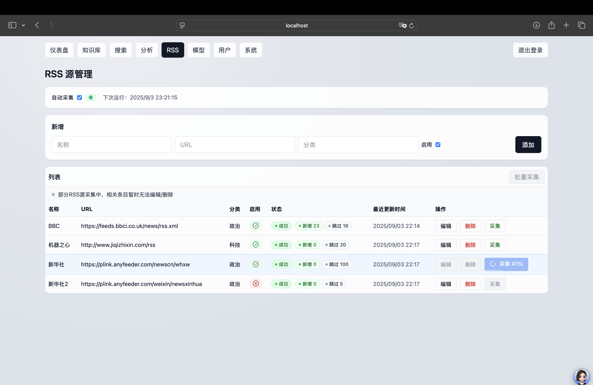

# Hua News AI Knowledge Base System

> An AI-powered intelligent news collection, processing, and retrieval system with RSS source management, knowledge base construction, semantic search, and email notification capabilities.

## 📋 Table of Contents

- [🚀 Quick Start](#quick-start)
- [📸 System Screenshots](#system-screenshots)
- [🏗️ Project Overview](#project-overview)
- [⚙️ System Requirements](#system-requirements)
- [🔧 Installation Guide](#installation-guide)
- [🚀 Starting Services](#starting-services)
- [📚 Features](#features)
- [🔌 API Interface](#api-interface)
- [📁 Project Structure](#project-structure)
- [🛠️ Development Guide](#development-guide)
- [❓ FAQ](#faq)
- [📖 Related Documentation](#related-documentation)

## 🚀 Quick Start

### One-Click Installation
```bash
# Clone the project
git clone https://github.com/leoomo/hua_news_ai_rag.git
cd hua_news_ai_rag

# Run the one-click installation script
python install.py
```

### Manual Installation
```bash
# 1. Backend setup
python scripts/setup_backend.py

# 2. Frontend setup
python scripts/setup_frontend.py

# 3. Database initialization
python scripts/init_database.py
```

### Start Services
```bash
# Start backend
cd backend && python run.py

# Start frontend
cd frontend && npm run dev
```

### Access System
- **Frontend Interface**: http://localhost:3000
- **Backend API**: http://localhost:5050
- **Default Account**: admin / admin123

---

## 📸 System Screenshots

> The following are system prototypes and page screenshots. For more details, please check the `snapshot/` directory.

- Login Page

  
  
  Clean and modern login interface with username/password authentication. Features loading state with spinner animation, error handling, and success notifications. Uses minimalist gray-white design with rounded input fields and hover effects.

- Dashboard (Overview)

  
  
  Displays total count, today/yesterday additions (with comparison arrows), 7-day average, category/source Top3 (clickable to jump to knowledge base filtering), last update time; right side includes "Last 7 Days Ingest" (values placed above bars, optimized proportions) and "Latest 8 Articles". Uses unified gray-white frosted glass style with rounded card design and hover micro-float effects.

- Knowledge Base (List/Filter/Batch Operations)

  
  
  Supports filtering by source/time/tags, inline tag editing, batch deletion and data import. Sources and categories support click-to-jump, table row hover highlighting, overall rounded card design.

- Knowledge Base Edit Mode

  
  
  Supports inline editing of article tags and categories with real-time save. Edit state input boxes use unified rounded design with gray ring hints on focus.

- Semantic Search (RAG Results with Citations)

  
  
  First retrieves knowledge base sorted by similarity, triggers web search if no hits, results include citation sources. Search result cards use frosted glass effects with hover micro-float, maintaining gray-white minimalist style.

- Web Search Results

  
  
  When local knowledge base finds no relevant content, automatically triggers web search to provide supplementary information. Web results use unified card style, maintaining visual consistency with local results.

- Model & API Configuration

  
  
  Configure Ollama/LLM, Embedding, Rerank parameters with online save and hot update support. Configuration cards use frosted glass effects, input boxes unified rounded design, save buttons use gray-black theme.

- Users & Roles

  
  
  Manage users, roles and permissions with disable/delete and role assignment operations. Tables use rounded card design, operation buttons unified style with hover micro-float effects.

- RSS Source Management (Add/Edit/Crawl)

  
  
  Supports RSS source add, edit, delete operations, and manual/batch crawling. Crawl buttons integrate progress display, auto-crawl status has breathing light effects, overall unified gray-white style.

- Data Analytics (Keywords/Trends)

  
  
  Provides keyword Top, ingest trends insights to assist understanding content structure and changes. Data cards use frosted glass effects with hover micro-float, maintaining visual consistency with dashboard.

- System Settings

  
  
  Email configuration, feature switches, send parameters and other system-level settings. Configuration cards use frosted glass effects, input boxes unified rounded design, hint information uses gray info bar style.

## 🏗️ Project Overview

Hua News AI Knowledge Base System is an AI-powered intelligent news collection, processing, and retrieval platform that integrates modern web technology stack and AI capabilities.

### Technology Stack
- **Backend**: Flask + SQLAlchemy + LangChain (Python 3.11+)
- **Frontend**: Next.js 14 + React 18 + TypeScript (Node.js 18+)
- **Database**: SQLite (supports extension to PostgreSQL/MySQL)
- **AI Capabilities**: Text embedding, vector search, intelligent Q&A, content summarization
- **Package Management**: Python uses uv, frontend uses npm

### Core Features
- 🔍 **Intelligent Search**: Vector similarity-based semantic search
- 📰 **RSS Collection**: Automated news source collection and content processing
- 📚 **Knowledge Base Management**: Article categorization, tagging, batch operations
- 👥 **User Management**: Role permissions, user groups, activity logs
- 📧 **Email Notifications**: Collection completion notifications, system message push
- 🤖 **AI Q&A**: Knowledge base-based intelligent Q&A system
- 📊 **Data Analytics**: Keyword analysis, trend statistics, visualization

## ⚙️ System Requirements

### Minimum Requirements
- **Operating System**: Windows 10/11, macOS 10.15+, Ubuntu 18.04+
- **Python**: 3.11 or higher
- **Node.js**: 18.0 or higher
- **Memory**: 4GB RAM
- **Storage**: 2GB available space

### Recommended Configuration
- **Operating System**: Windows 11, macOS 12+, Ubuntu 20.04+
- **Python**: 3.11+
- **Node.js**: 20.0+
- **Memory**: 8GB RAM
- **Storage**: 5GB available space

### Optional Components
- **Ollama**: For local large model Q&A (RAG functionality)
  - Install: https://ollama.com/
  - Model: `ollama pull qwen2.5:3b`
- **uv**: Python package manager (recommended)
  - Install: `curl -LsSf https://astral.sh/uv/install.sh | sh`

## 🔧 Installation Guide

### Automatic Installation (Recommended)
```bash
# Run one-click installation script
python install.py
```

### Step-by-Step Installation

#### 1. Backend Setup
```bash
# Run backend initialization script
python scripts/setup_backend.py

# Or manual installation
uv sync
uv sync -E langchain  # Optional: install LangChain functionality
```

#### 2. Frontend Setup
```bash
# Run frontend initialization script
python scripts/setup_frontend.py

# Or manual installation
cd frontend
npm install
```

#### 3. Database Initialization
```bash
# Run database initialization script
python scripts/init_database.py

# Or manual initialization
sqlite3 hua_news.db < db/init_database.sql
```

### Environment Configuration

#### Backend Environment Variables (.env)
```env
# Database configuration
DATABASE_URL=sqlite:///./hua_news.db
SECRET_KEY=your-secret-key-here

# Service configuration
PORT=5050

# Collection configuration
FETCH_TIMEOUT_SEC=8
FETCH_RETRIES=3
RATE_LIMIT_DOMAIN_QPS=1
ENABLE_ENRICH=true
ENABLE_EMBED=true
EMBED_BATCH_SIZE=64
CHUNK_SIZE=800
CHUNK_OVERLAP=120
SIMHASH_HAMMING_THRESHOLD=4

# Baidu Search API (optional)
BAIDU_API_KEY=
BAIDU_SECRET_KEY=

# Web search configuration
ENABLE_WEB_SEARCH=true
WEB_SEARCH_FALLBACK=true
```

#### Frontend Environment Variables (.env.local)
```env
# API base URL
NEXT_PUBLIC_API_BASE_URL=http://localhost:5050

# Application configuration
NEXT_PUBLIC_APP_NAME=Hua News AI Knowledge Base System
NEXT_PUBLIC_APP_VERSION=1.0.0
```

## 🚀 Starting Services

### Development Environment

#### Start Backend Service
```bash
cd backend
python run.py
# Default port: 5050
# Health check: http://localhost:5050/api/health
```

#### Start Frontend Service
```bash
cd frontend
npm run dev
# Default port: 3000
# Access URL: http://localhost:3000
```

### Production Environment

#### Backend Service
```bash
# Using Gunicorn (recommended)
pip install gunicorn
gunicorn -w 4 -b 0.0.0.0:5050 core.app:create_app()

# Or using uWSGI
pip install uwsgi
uwsgi --http :5050 --module core.app:create_app --callable app
```

#### Frontend Service
```bash
cd frontend
# Build production version
npm run build

# Start production service
npm start
```

### One-Click Startup Scripts
```bash
# Windows
startup_scripts/start_all.bat

# Linux/macOS
./startup_scripts/start_all.sh
```

## 📚 Features

### 🔍 Intelligent Search
- **Semantic Search**: Vector similarity-based intelligent retrieval
- **Hybrid Search**: Combines keyword and semantic search
- **Web Search**: Automatically supplements with web search when local results are insufficient
- **Citation Tracing**: Search results include source links

### 📰 RSS Collection Management
- **Multi-Source Collection**: Supports multiple RSS sources simultaneously
- **Automatic Collection**: Scheduled automatic collection with configurable intervals
- **Manual Collection**: Supports single-source and batch manual collection
- **Content Deduplication**: SimHash-based intelligent deduplication
- **Status Monitoring**: Real-time collection status and progress display

### 📚 Knowledge Base Management
- **Article Management**: Supports CRUD operations for articles
- **Category Tags**: Flexible article categorization and tagging system
- **Batch Operations**: Supports batch deletion, import, and other operations
- **Content Editing**: Inline editing of article tags and categories
- **Search Filtering**: Multi-dimensional filtering and search

### 👥 User Permission Management
- **User Management**: Complete user CRUD operations
- **Role Permissions**: Role-based access control system
- **User Groups**: Supports user group management
- **Activity Logs**: Detailed user operation logs
- **Session Management**: JWT token and session management

### 📧 Email Notification System
- **Collection Notifications**: Automatic email sending upon RSS collection completion
- **Multiple Recipients**: Supports multiple recipient configuration
- **Email Templates**: Customizable email content and format
- **Send Status**: Detailed email sending status feedback
- **Retry Mechanism**: Automatic retry on send failure

### 🤖 AI Intelligent Features
- **Intelligent Q&A**: Knowledge base-based Q&A system
- **Content Summarization**: Automatic article summarization
- **Keyword Extraction**: Intelligent article keyword extraction
- **Vector Search**: FAISS-based efficient vector retrieval
- **Model Configuration**: Supports multiple AI model configurations

### 📊 Data Analytics
- **Dashboard**: Data overview and statistical information
- **Trend Analysis**: Article ingest trend analysis
- **Keyword Statistics**: Popular keyword analysis
- **Source Analysis**: RSS source effectiveness analysis
- **Visualization Charts**: Intuitive data display

## 🔌 API Interface

### Interface Documentation
- **OpenAPI Specification**: `openapi.yaml`
- **Detailed Documentation**: `doc/backend_api.md`
- **Base URL**: `http://localhost:5050`

### Core API Endpoints

#### Authentication Related
- `POST /api/auth/login` - User login
- `POST /api/auth/logout` - User logout
- `GET /api/auth/me` - Get current user information

#### User Management
- `GET /api/users` - Get user list
- `POST /api/users` - Create user
- `PUT /api/users/{id}` - Update user
- `DELETE /api/users/{id}` - Delete user
- `GET /api/user-roles` - Get role list
- `GET /api/user-groups` - Get user group list

#### RSS Management
- `GET /api/settings/rss` - Get RSS source list
- `POST /api/settings/rss` - Create RSS source
- `PUT /api/settings/rss/{id}` - Update RSS source
- `DELETE /api/settings/rss/{id}` - Delete RSS source
- `POST /api/settings/rss/ingest/{id}` - Manual collection
- `POST /api/settings/rss/ingest-all` - Batch collection

#### Knowledge Base
- `GET /api/kb/items` - Get article list
- `GET /api/kb/items/{id}` - Get article details
- `PUT /api/kb/items/{id}` - Update article
- `DELETE /api/kb/items/{id}` - Delete article
- `POST /api/kb/items/batch-delete` - Batch delete

#### Search Functionality
- `POST /api/search/semantic` - Semantic search
- `POST /api/search/qa` - Intelligent Q&A

#### System Settings
- `GET /api/settings` - Get system settings
- `PUT /api/settings` - Update system settings
- `GET /api/settings/models` - Get model configuration
- `PUT /api/settings/models` - Update model configuration
- `POST /api/email/test` - Test email sending

#### Data Analytics
- `GET /api/dashboard/summary` - Get dashboard data
- `GET /api/analytics/keywords` - Get keyword statistics
- `GET /api/analytics/trends` - Get trend analysis

### API Testing
- **HTTP Collection**: `tests/api.http` (VS Code REST Client)
- **Smoke Test**: `tests/smoke_test.py` (Python requests)
- **Test Report**: `tests/api_test_report.md`

## 📁 Project Structure

```
hua_news_ai_rag/                    # Project root directory
├── backend/                        # Backend module
│   ├── core/                       # Core application layer
│   │   └── app.py                  # Flask main application entry
│   ├── data/                       # Data layer
│   │   ├── db.py                   # Database connection management
│   │   ├── models.py               # Basic data models
│   │   ├── user_management_models.py # User management models
│   │   └── model_config_models.py  # Model configuration models
│   ├── ai/                         # AI service layer
│   │   ├── embeddings.py           # Text embedding service
│   │   ├── enrich.py               # Text enhancement tools
│   │   ├── qa.py                   # Q&A system
│   │   └── vectorstore.py          # Vector search functionality
│   ├── crawler/                    # Data collection layer
│   │   ├── fetcher.py              # HTTP fetcher
│   │   ├── ingest.py               # RSS collection processing
│   │   └── ingest_utils.py         # Collection utilities
│   ├── routes/                     # API route layer
│   │   ├── auth.py                 # Authentication endpoints
│   │   ├── users.py                # User management endpoints
│   │   ├── rss.py                  # RSS management endpoints
│   │   ├── kb.py                   # Knowledge base endpoints
│   │   ├── models_settings.py      # Model configuration endpoints
│   │   ├── settings.py             # System settings endpoints
│   │   ├── email_test.py           # Email test endpoints
│   │   └── user_*.py               # User management related endpoints
│   ├── services/                   # Domain services
│   │   ├── ai_summary.py           # AI summary service
│   │   ├── web_search.py           # Web search service
│   │   └── simple_web_search.py    # Simple search service
│   ├── email_fly/                  # Email module
│   │   ├── email_sender.py         # Email sending service
│   │   ├── email_templates.py      # Email templates
│   │   └── db_email_sender.py      # Database email sender
│   ├── scripts/                    # Script tools
│   │   ├── export_openapi.py       # OpenAPI export
│   │   └── migrate_*.py            # Database migration scripts
│   ├── config.py                   # Application configuration
│   └── run.py                      # Service startup file
├── frontend/                       # Frontend application
│   ├── app/                        # Next.js application directory
│   │   ├── page.tsx                # Home page
│   │   ├── login/                  # Login page
│   │   ├── kb/                     # Knowledge base page
│   │   ├── search/                 # Search page
│   │   ├── settings/               # Settings page
│   │   │   ├── rss/                # RSS management
│   │   │   ├── models/             # Model configuration
│   │   │   ├── system/             # System settings
│   │   │   └── users/              # User management
│   │   └── analytics/              # Data analytics
│   ├── components/                 # Component library
│   │   ├── UserManagement/         # User management components
│   │   ├── Nav.tsx                 # Navigation component
│   │   ├── Notification.tsx        # Notification component
│   │   └── ContentModal.tsx        # Content modal
│   ├── lib/                        # Utility library
│   │   ├── api.ts                  # API client
│   │   ├── auth.ts                 # Authentication utilities
│   │   └── validators.ts           # Validators
│   └── package.json                # Frontend dependency configuration
├── db/                             # Database related
│   ├── init_database.sql           # Database initialization script
│   ├── schema.sql                  # Basic table structure
│   ├── seed.sql                    # Seed data
│   └── user_management_schema.sql  # User management table structure
├── scripts/                        # Installation scripts
│   ├── init_database.py            # Database initialization script
│   ├── setup_backend.py            # Backend setup script
│   └── setup_frontend.py           # Frontend setup script
├── doc/                            # Project documentation
│   ├── backend_api.md              # API documentation
│   ├── system_architecture_document.md # System architecture document
│   ├── product_requirements_document.md # Product requirements document
│   └── user_management_design.md   # User management design document
├── tests/                          # Test files
│   ├── api.http                    # HTTP test collection
│   ├── smoke_test.py               # Smoke test
│   └── api_test_report.md          # Test report
├── snapshot/                       # System screenshots
├── install.py                      # One-click installation script
├── INSTALLATION.md                 # Detailed installation guide
├── README_INSTALL.md               # Quick installation guide
├── pyproject.toml                  # Python project configuration
├── openapi.yaml                    # OpenAPI specification
└── hua_news.db                     # SQLite database file
```

## 🛠️ Development Guide

### Development Environment Setup
```bash
# Backend development
cd backend
source ../.venv/bin/activate
python run.py

# Frontend development
cd frontend
npm run dev
```

### Code Formatting
```bash
# Backend code formatting
pip install black isort flake8
black backend/
isort backend/
flake8 backend/

# Frontend code formatting
npm install -g prettier
prettier --write frontend/
```

### Testing
```bash
# Backend testing
cd backend
python -m pytest

# Frontend testing
cd frontend
npm test
```

### Debugging
```bash
# Backend debugging
cd backend
python -m pdb run.py

# Frontend debugging
cd frontend
npm run dev -- --inspect
```

## ❓ FAQ

### 🔌 Connection Issues
**Q: Frontend reports error accessing API**
- Confirm `NEXT_PUBLIC_API_BASE_URL` points to actual backend address
- Default configuration: Frontend `http://localhost:3000` ↔ Backend `http://localhost:5050`
- If needed, set in `frontend/.env.local`: `NEXT_PUBLIC_API_BASE_URL=http://localhost:5050`

**Q: Port conflicts**
- Check port usage: `lsof -i :5050` and `lsof -i :3000`
- Modify backend port: `PORT=8080 python run.py`

### 🐍 Python Related Issues
**Q: Import errors (ImportError)**
- Run fix script: `cd backend && python fix_imports.py`
- Ensure correct startup method: `python run.py`

**Q: Virtual environment issues**
- Ensure virtual environment is activated: `source .venv/bin/activate`
- Check Python version: `python --version` (recommend 3.11+)

### 🗄️ Database Issues
**Q: Database connection failure**
- Confirm `hua_news.db` file path is correct
- Check `database_url` configuration in `backend/config.py`
- Default path: `hua_news.db` in project root directory

**Q: Table does not exist error**
- Tables are automatically created on first startup
- Manual check: `sqlite3 hua_news.db ".tables"`

### 🤖 AI Function Issues
**Q: RAG/QA cannot be used**
- Execute: `uv sync -E langchain`
- Ensure local LLM service is available (e.g., Ollama)
- Pull model: `ollama pull qwen2.5:3b`

**Q: Vector search failure**
- Check if FAISS index is correctly created
- Confirm text embedding service is running normally
- Check error messages in backend logs

### 🚀 Startup Issues
**Q: Backend startup failure**
- Check if dependencies are completely installed: `uv sync`
- Confirm port is not occupied
- Check error logs

**Q: Frontend startup failure**
- Check Node.js version: `node --version` (recommend 18+)
- Reinstall dependencies: `cd frontend && rm -rf node_modules && npm install`
- Clear cache: `npm run dev -- --clear`

### 📧 Email Issues
**Q: Email sending failure**
- Check email configuration: System Settings → Email Settings
- Verify SMTP settings and authentication information
- Check email sending logs

**Q: Email notifications not working**
- Confirm email module is enabled
- Check recipient email configuration
- Verify RSS collection is working normally

## 📖 Related Documentation

### Installation & Deployment
- [Detailed Installation Guide](INSTALLATION.md) - Complete installation and configuration instructions
- [Quick Installation Guide](README_INSTALL.md) - Quick start guide

### Technical Documentation
- [API Interface Documentation](doc/backend_api.md) - Complete backend API documentation
- [System Architecture Document](doc/system_architecture_document.md) - System architecture design
- [Product Requirements Document](doc/product_requirements_document.md) - Product feature requirements
- [User Management Design](doc/user_management_design.md) - User permission system design

### Development Documentation
- [Data Collection Technical Document](doc/data_collection_technical_doc.md) - RSS collection technical implementation
- [System Architecture Code Configuration](doc/system_architecture_code_and_config.md) - Code architecture description

### Testing Documentation
- [API Test Report](tests/api_test_report.md) - Interface test results
- [HTTP Test Collection](tests/api.http) - VS Code REST Client tests

---

## 📄 License

This project is licensed under the MIT License. See LICENSE file for details.

---

## 🤝 Contributing

Welcome to submit Issues and Pull Requests to improve the project!

---

**⚠️ Important Reminder**: Please change the default password and configure production environment settings promptly after installation!
