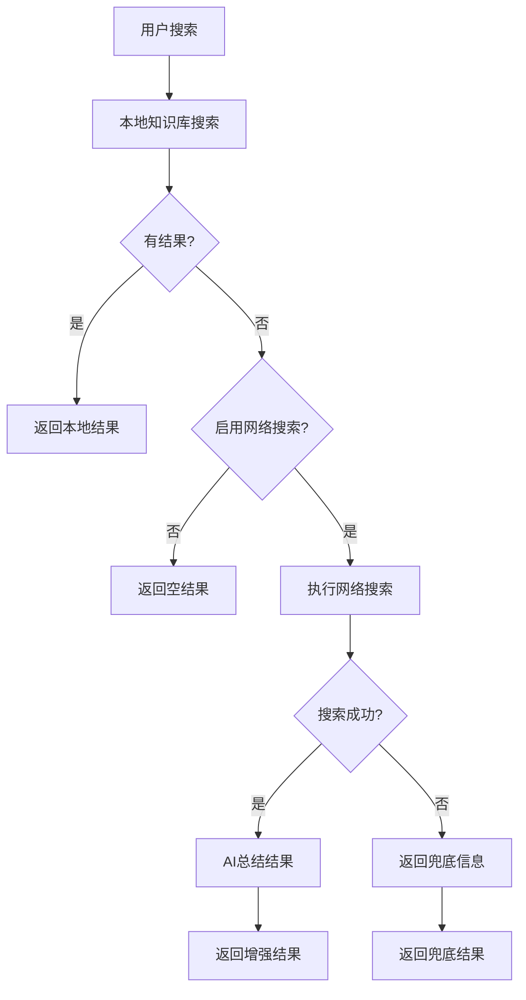

# 网络搜索功能实现说明

## 功能概述

本功能实现了当本地知识库搜索无结果时，自动触发联网查询，获取前3条搜索结果并通过大语言模型进行智能总结的功能。

## 架构设计

### 1. 服务层 (Services)

#### WebSearchService (百度API版本)
- 位置: `services/web_search.py`
- 功能: 使用百度智能云API进行网络搜索
- 依赖: 需要配置百度API密钥
- 特点: 搜索结果质量高，但需要API密钥和配额

#### SimpleWebSearchService (免费版本)
- 位置: `services/simple_web_search.py`
- 功能: 使用DuckDuckGo等免费搜索源
- 依赖: 仅需网络连接
- 特点: 无需API密钥，有兜底机制

#### AISummaryService (AI总结)
- 位置: `services/ai_summary.py`
- 功能: 使用大语言模型对搜索结果进行智能总结
- 依赖: LangChain + Ollama
- 特点: 提供结构化的信息总结

### 2. 配置层 (Config)

- 位置: `config.py`
- 新增配置项:
  - `baidu_api_key`: 百度API密钥
  - `baidu_secret_key`: 百度API密钥
  - `enable_web_search`: 是否启用网络搜索
  - `web_search_fallback`: 是否启用自动兜底

### 3. 接口层 (Routes)

#### 自动触发
- 接口: `POST /search/semantic`
- 逻辑: 本地搜索无结果时自动触发网络搜索
- 返回: 包含网络搜索结果的增强响应

#### 手动触发
- 接口: `POST /search/web`
- 逻辑: 专门的网络搜索接口
- 返回: 网络搜索结果和AI总结

## 工作流程



## 使用方法

### 1. 环境配置

创建 `.env` 文件（可选，用于百度API）:

```bash
# 百度搜索API配置（可选）
BAIDU_API_KEY=your-baidu-api-key
BAIDU_SECRET_KEY=your-baidu-secret-key

# 网络搜索配置
ENABLE_WEB_SEARCH=true
WEB_SEARCH_FALLBACK=true
```

### 2. 自动触发示例

当调用语义搜索接口且本地无结果时：

```bash
POST /search/semantic
{
  "query": "最新AI技术",
  "top_k": 10,
  "min_score": 0.8
}
```

可能的响应：

```json
{
  "code": 0,
  "data": [],
  "web_search": {
    "summary": "基于网络搜索结果，最新AI技术主要包括...",
    "web_results": [
      {
        "title": "2024年AI技术突破",
        "snippet": "最新研究显示...",
        "url": "https://example.com",
        "source": "duckduckgo"
      }
    ],
    "source": "web_search",
    "query": "最新AI技术"
  },
  "message": "本地知识库未找到相关内容，已为您联网查询并总结"
}
```

### 3. 手动网络搜索

```bash
POST /search/web
{
  "query": "机器学习应用",
  "top_k": 3
}
```

## 配置选项

| 配置项 | 默认值 | 说明 |
|--------|--------|------|
| `ENABLE_WEB_SEARCH` | `true` | 是否启用网络搜索功能 |
| `WEB_SEARCH_FALLBACK` | `true` | 本地搜索无结果时是否自动触发 |
| `BAIDU_API_KEY` | `""` | 百度API密钥（可选） |
| `BAIDU_SECRET_KEY` | `""` | 百度API密钥（可选） |

## 依赖要求

### 必需依赖
- `requests`: HTTP请求库
- `flask`: Web框架

### 可选依赖
- `langchain`: AI总结功能
- `ollama`: 本地大语言模型

### 安装命令
```bash
# 基础依赖
uv sync

# AI功能依赖
uv sync -E langchain
```

## 故障排除

### 常见问题

1. **网络搜索失败**
   - 检查网络连接
   - 确认防火墙设置
   - 查看服务日志

2. **AI总结失败**
   - 确认Ollama服务运行状态
   - 检查模型是否已下载
   - 验证LangChain安装

3. **搜索结果为空**
   - 检查搜索关键词
   - 确认搜索服务状态
   - 查看兜底机制是否生效

### 日志查看

网络搜索相关的日志会输出到控制台，包括：
- 搜索请求状态
- API调用结果
- 错误信息
- 兜底机制触发

## 扩展建议

### 1. 添加更多搜索源
- Google搜索（需要API密钥）
- Bing搜索（需要API密钥）
- 自定义搜索源

### 2. 增强AI总结
- 支持多语言
- 添加情感分析
- 实现结果分类

### 3. 缓存机制
- 搜索结果缓存
- AI总结结果缓存
- 避免重复搜索

### 4. 监控和统计
- 搜索成功率统计
- API调用频率监控
- 用户满意度反馈

## 测试

运行测试脚本验证功能：

```bash
# 测试网络搜索服务
python3 test_web_search.py

# 测试简单搜索服务
python3 test_simple_search.py
```

## 注意事项

1. **网络搜索有延迟**，建议设置合适的超时时间
2. **免费搜索源可能不稳定**，建议实现多源备选
3. **AI总结依赖本地模型**，确保Ollama服务稳定运行
4. **生产环境建议**配置适当的重试和限流机制
