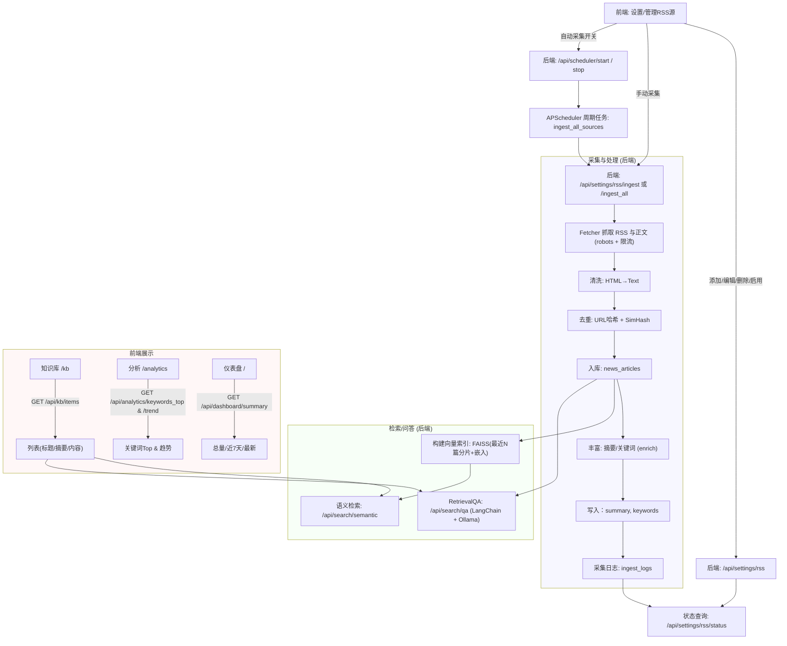
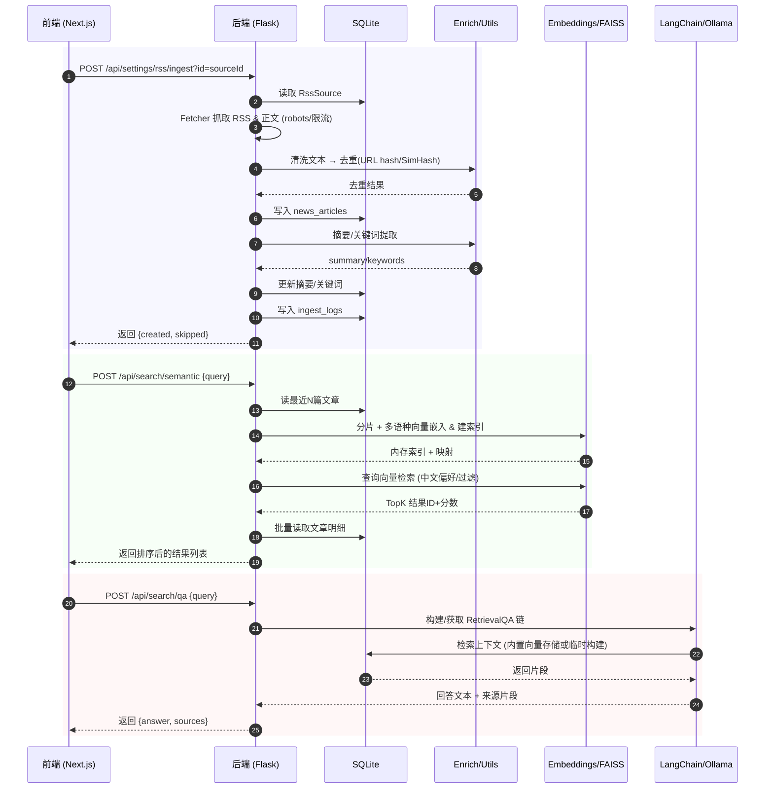

## 业务总览

本系统覆盖“RSS 源管理与采集 → 数据清洗/去重/丰富 → 知识库与向量索引 → 检索/问答 → 分析/仪表盘”，并提供自动与手动采集两种模式。

### 业务流程图

### 核心说明
- 采集入口：手动触发（单源或批量）与自动计划任务（APScheduler）。
- 处理流水线：抓取→清洗→去重→入库→丰富（摘要/关键词）。
- 检索：优先使用多语种向量检索，中文查询时启用中文偏好与中文严格过滤（纯中文时）。
- 问答：LangChain RetrievalQA，基于片段检索的回答与来源回溯。
- 分析/仪表盘：关键词统计、近7天趋势、总量+最新。

---

### 关键交互时序图（手动采集与检索）

### 端点清单（关键）
- 设置/源管理：
  - POST/PATCH/DELETE/GET `/api/settings/rss`（增改删查）
  - POST `/api/settings/rss/ingest?id=`（单源采集）
  - POST `/api/settings/rss/ingest_all`（批量采集）
  - GET `/api/settings/rss/status`（采集日志状态）
- 检索与问答：
  - POST `/api/search/semantic`（语义检索，中文偏好/过滤策略已启用）
  - POST `/api/search/qa`（检索增强问答）
- 知识库与详情：
  - GET `/api/kb/items`（标题/摘要/内容）
  - GET `/api/kb/item?id=`（文章详情）
- 分析与仪表盘：
  - GET `/api/analytics/keywords_top`、`/api/analytics/trend`（关键词Top、日趋势）
  - GET `/api/dashboard/summary`（总数、近7天、最新5篇）
- 调度控制：
  - POST `/api/scheduler/start`（创建周期任务并立即运行一次）
  - POST `/api/scheduler/stop`（删除周期任务）
  - GET `/api/scheduler/status`（是否启用、任务下次运行时间）

### 非功能性要点
- 性能：抓取限流、FAISS 内存索引（最近N篇）、多语种嵌入批量化。
- 稳定性：启动时确保表/列存在；采集失败写日志并不中断其他源。
- 可维护性：模块化（fetcher/enrich/utils/embeddings/vectorstore/qa），端点清晰。
- 安全与合规：遵循 robots，避免高频抓取；用户态鉴权在中间件（已预留）。

