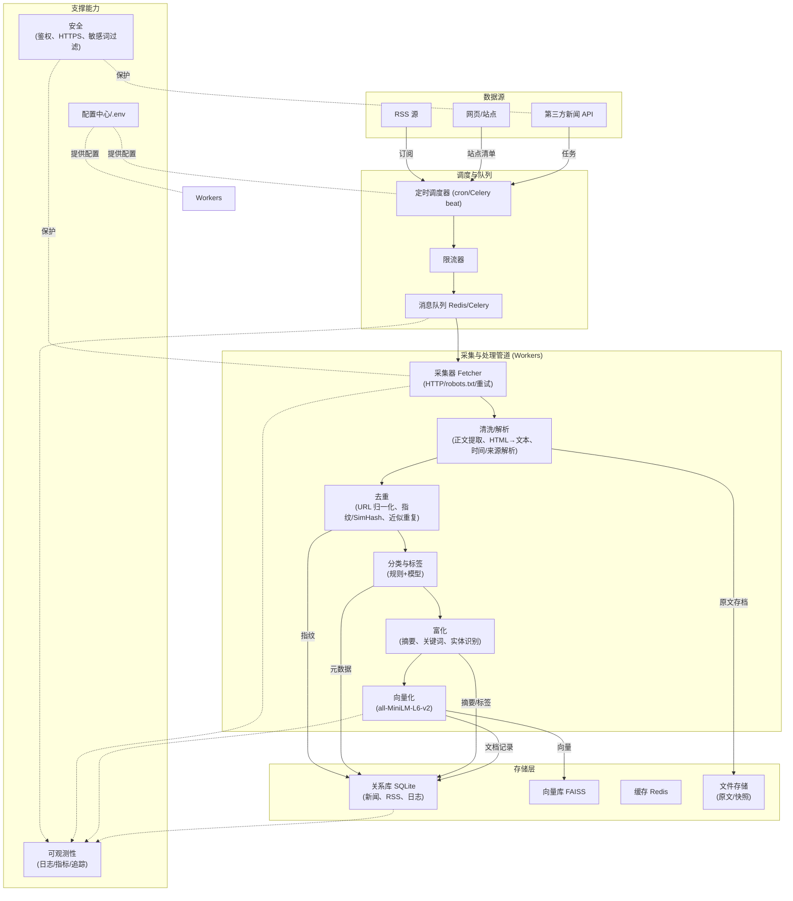
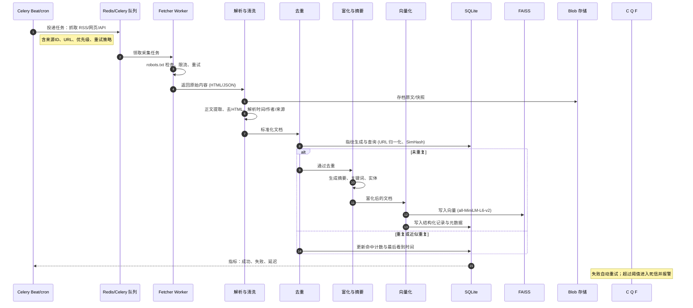

## 数据采集技术文档

### 1. 目标与范围
- **目标**: 稳定、合规地从 RSS、网页与新闻 API 采集新闻，完成清洗、去重、富化、向量化与入库，为检索与分析提供高质量数据底座。
- **范围**: 调度、抓取、清洗解析、去重、分类与标签、摘要与关键词、向量化入库、指标监控、限流与合规。

### 2. 总体架构
核心技术栈：API 网关（Flask/FastAPI）、任务队列（Celery + Redis）、关系库（SQLite）、向量库（FAISS）、本地模型（Ollama Qwen2.5 3B）与嵌入（all-MiniLM-L6-v2）。



### 3. 组件说明
- **Scheduler（定时调度）**: 使用 cron 或 Celery Beat 以源为单位投递任务，携带来源ID、URL、优先级、重试策略。
- **RateLimiter（限流器）**: 基于域名/源维度的并发与 QPS 控制，避免封禁与拥塞。
- **Queue（消息队列）**: Redis 作为 broker 与 result backend；按来源/优先级设置多队列。
- **Fetcher（采集器）**:
  - HTTP 抓取，遵守 robots.txt；UA、超时、重试、退避、代理池。
  - 优先 RSS/静态页面，按需渲染（减少成本）。
- **Cleaner（清洗/解析）**:
  - 正文提取（去导航/脚注/广告）、HTML→纯文本、时间/作者/来源解析与标准化；原文快照入 Blob。
- **Dedup（去重）**:
  - URL 归一化、主键指纹（url_hash）、内容指纹（SimHash/MinHash）、近似重复阈值。
- **Classifier（分类与标签）**:
  - 规则 + 模型：来源/栏目 → 初级分类；模型 → 主题/行业标签。
- **Enricher（富化）**:
  - 摘要、关键词、实体识别；优先本地模型（Ollama Qwen2.5 3B），超时回退规则/统计方法。
- **Embedder（向量化）**:
  - 使用 all-MiniLM-L6-v2 生成 384 维向量；分块策略（字数/句子数）与去噪；入 FAISS。
- **存储**:
  - SQLite（新闻元数据、RSS 源、日志/指标）、FAISS（向量索引）、Redis（缓存）、Blob（原文/快照）。
- **Observability（可观测）**:
  - 采集量、成功率、延迟、近似重复率、入库速率、失败分布；Tracing 覆盖抓取-清洗-向量化链路。
- **Security（安全）**:
  - 源白名单/黑名单、敏感词/敏感域过滤、HTTPS/代理、凭证隔离、输出净化。

### 4. 采集流程（时序）


### 5. 数据模型（核心表/索引）
- `rss_sources`：id, name, url, status, schedule_cron, last_run_at, rate_limit_qps
- `articles`：id, url, url_hash, source_id, title, author, published_at, language, content_text, raw_blob_path, summary, keywords, tags, simhash, created_at, updated_at, dedup_group_id
  - 索引：url_hash 唯一，simhash 辅助，published_at，source_id
- `article_chunks`：id, article_id, chunk_index, content_text, embedding(vec_384), created_at
  - 向量索引：FAISS 外部保存（article_id, chunk_index, meta）
- `ingest_logs`：id, task_id, source_id, url, status, latency_ms, retries, error_code, error_message, created_at

### 6. 异常与重试策略
- 网络/超时：重试 3 次，指数退避（1.8），最大 60s。
- HTTP 429：退避与下调该源 QPS，短期冻结域名。
- 解析失败：切换备用解析器 → 回退规则法 → 死信队列。
- 向量化失败：降级重试；必要时先入库文本，延迟向量化。
- 幂等：以 url_hash 保证重复投递不重复入库。

### 7. 性能与容量
- 单机目标：≥1000 条/分钟入库（批处理、并发、缓存 ETag/Last-Modified）。
- 扩展：横向扩展 workers；按源分片；FAISS 多 shard 与定期重建/合并。
- 存储：原文快照冷热分层；SQLite 可后续迁移 PostgreSQL。

### 8. 安全与合规
- 遵守 robots.txt 与站点条款；仅存储公开内容；控制抓取频率。
- 敏感内容过滤；来源白名单；审计日志；最小权限与加密传输。

### 9. 监控与告警
- 指标：成功率、P50/P95 延迟、错误率（按类型/域名）、近似重复率、入库速率、嵌入耗时、队列积压、死信数。
- 日志：任务级结构化日志（task_id、source_id、url、阶段、耗时、结果/错误码）。
- Trace：覆盖 Fetch→Clean→Dedup→Enrich→Embed→Store。
- 告警：阈值触发（错误率>5%、队列滞留>5min、向量化失败>2%）。

### 10. 配置与开关（示例）
```ini
# .env（示例）
BROKER_URL=redis://localhost:6379/0
RESULT_BACKEND=redis://localhost:6379/1
WORKER_CONCURRENCY=8
FETCH_TIMEOUT_SEC=8
FETCH_RETRIES=3
RATE_LIMIT_DOMAIN_QPS=1
EMBEDDING_MODEL=all-MiniLM-L6-v2
EMBED_BATCH_SIZE=64
CHUNK_SIZE=800
CHUNK_OVERLAP=120
SIMHASH_HAMMING_THRESHOLD=4
ENABLE_ENRICH=true
ENABLE_EMBED=true
```

### 11. MVP 范围与验收
- MVP：RSS 采集、清洗、去重、摘要/关键词（轻量模型/规则）、向量化（all-MiniLM-L6-v2）、入库（SQLite+FAISS）、基础监控。
- 验收：日处理 ≥10k；端到端失败率 <3%；平均入库延迟 <5s；近似重复召回 >90%。


